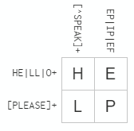
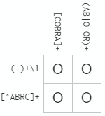

# Bring rectangular data in

```r
## load gapminder
suppressPackageStartupMessages(library(gapminder))
## load tidyverse
suppressPackageStartupMessages(library(tidyverse))
## load testthat
suppressPackageStartupMessages(library(testthat))
```

# Task 1: Character data

## Exercises 14.2.5

### Question 1

**In code that doesn't use stringr, you'll often see `paste()` and `paste0()`. What's the difference between the two functions?**

The usages of `paste()` and `paste0()` can be obtained by running `?paste` in console, and they are listed as followed.

`paste (..., sep = " ", collapse = NULL)`

`paste0(..., collapse = NULL)`

So the difference is, `paste()` allows us to add an separator between strings we want to concatenate. Let's try to use `paste()` and `paste0()` to show their differences.
  

```r
# make paste() and paste0() have the same outputs
paste("STAT", "547M", sep = "")
```

```
## [1] "STAT547M"
```

```r
paste0("STAT", "547M")
```

```
## [1] "STAT547M"
```

```r
# modify the separator in paste() to have different output
paste("STAT", "547M", sep = " ")
```

```
## [1] "STAT 547M"
```

**What stringr function are they equivalent to?**

`str_c()` is equaivalent to `paste()` and `paste0()`. The usage of `str_c()` is:

`str_c(..., sep = "", collapse = NULL)`

Here are two examples.


```r
# the default str_c() (without sep) is the same as paste0()
str_c("STAT", "547M")
```

```
## [1] "STAT547M"
```

```r
# with sep, str_c() is the same as paste()
str_c("STAT", "547M", sep = " ")
```

```
## [1] "STAT 547M"
```

**How do the functions differ in their handling of `NA`?**  

For `paste()` and `paste0()`, `NA` is directly convert to a string "NA", and concatenate with other strings. However, if `NA` is one of the input strings for `str_c()`, the output of `str_c()` will become `NA`.


```r
# paste() and paste0() convert NA to a string
paste("NA is ", NA, sep = "")
```

```
## [1] "NA is NA"
```

```r
paste0("NA is ", NA)
```

```
## [1] "NA is NA"
```

```r
# str_c() returns NA is one of the input strings is NA
str_c("NA is ", NA)
```

```
## [1] NA
```

### Question 2

**In your own words, describe the difference between the `sep` and `collapse` arguments to `str_c()`.**

`sep` and `collapse` try to handle two different types of inputs. If we use multiple strings as input, the string defined in `sep` will be added between two neighboring input strings. If we use a vector as an input and `collapse` is defined, `str_c()` tries to combine strings inside the vector, and add the string defined in `collapse` between two neiboring strings.


```r
# let's create two vector to concatenate
stat_547m <- c("STAT", "547M")
subject_code <- c("Department", "Code")

# sep is used for input strings
str_c("STAT", "547M", sep = " ")
```

```
## [1] "STAT 547M"
```

```r
# since str_c() concatenate vectors by item, if only one vector is input, it will not be concatenated
str_c(stat_547m, sep = " ")
```

```
## [1] "STAT" "547M"
```

```r
# use collapse to concatenate vector
str_c(stat_547m, collapse = " ")
```

```
## [1] "STAT 547M"
```

```r
# we can use sep to concatenate two vectors by items
str_c(subject_code, stat_547m, sep = ": ")
```

```
## [1] "Department: STAT" "Code: 547M"
```

```r
# we can use sep and collapse together to concatenate two vectors into one string
str_c(subject_code, stat_547m, sep = ": ", collapse = ", ")
```

```
## [1] "Department: STAT, Code: 547M"
```

### Question 3

**Use `str_length()` and `str_sub()` to extract the middle character from a string.**


```r
# create two strings for this question, with odd number of characters
string_odd <- "oddnumber"

# let's define a function to get the middle index of a string with odd number of characters
func_index_odd <- function(s) {
  return(str_length(s) / 2 + 1)
}

# extract the middle character of string_odd, which is u
index_odd <- func_index_odd(string_odd)
str_sub(string_odd, index_odd, index_odd)
```

```
## [1] "u"
```


**What will you do if the string has an even number of characters?**

We try to get the middle two characters if the number of characters in a string is an even number.


```r
# create two strings for this question, with even number of characters
string_even <- "evennumber"

# let's define a function to get the LEFT middle index of a string with even umber of characters
func_index_even <- function(s) {
  return(str_length(s) / 2)
}

# extract the middle two characters of string_even, which are nu. here we need to add 1 for the end index
index_even <- func_index_even(string_even)
str_sub(string_even, index_even, index_even + 1)
```

```
## [1] "nu"
```

### Question 4

**What does `str_wrap()` do? When might you want to use it?**

According to `?str_wrap`, this function tries to wrap paragraph into multiple lines using an algorithm called "Knuth-Plass paragraph wrapping algorithm". An introduction of this algorithm can be found [here](https://www.ugrad.cs.ubc.ca/~cs490/2015W2/lectures/Knuth.pdf).

Therefore, if we want to show a long paragraph, and fit it into a page, we can try to use `str_wrap()`. Here we have an example extracted form the page of [Homework 06](http://stat545.com/Classroom/assignments/hw06/hw06.html).


```r
# a very long paragraph
long_paragraph <- "Exceeded the requirements in number of dimensions. Developed novel tasks that were indeed interesting and 'worked'. Impressive use of R - maybe involving functions, packages or workflows that weren't given in class materials. Impeccable organization of repo and report. You learned something new from reviewing their work and you're eager to incorporate it into your work."

# let's try to print it without wrapping
cat(long_paragraph)
```

```
## Exceeded the requirements in number of dimensions. Developed novel tasks that were indeed interesting and 'worked'. Impressive use of R - maybe involving functions, packages or workflows that weren't given in class materials. Impeccable organization of repo and report. You learned something new from reviewing their work and you're eager to incorporate it into your work.
```

```r
# let's try to print it after wrapping, and seperate by new line
cat(str_wrap(long_paragraph), sep = "\n")
```

```
## Exceeded the requirements in number of dimensions. Developed novel tasks that
## were indeed interesting and 'worked'. Impressive use of R - maybe involving
## functions, packages or workflows that weren't given in class materials.
## Impeccable organization of repo and report. You learned something new from
## reviewing their work and you're eager to incorporate it into your work.
```

The length of each line after wrapping are almost the same.

### Question 5

**What does `str_trim()` do?**

`str_trim()` deletes all starting and ending spaces from a string.


```r
# create a string for testing
string_with_spaces = "  STAT 547M  "

# use str_trim() to delete all spaces at the beginning and the end of the string
string_no_spaces <- str_trim(string_with_spaces)
string_no_spaces
```

```
## [1] "STAT 547M"
```


**What's the opposite of `str_trim()`?**

We can use `str_pad()` to add spaces or other characters. The usage of `str_pad()` is:

`str_pad(string, width, side = c("left", "right", "both"), pad = " ")`

We try to pad `string_no_sapces` back to `string_with_spaces`. Notice that, we need to add two spaces both at the beginning and the end of the string, which means we need to make the width of the final string 4 characters more.


```r
# we try to pad string_no_spaces back to string_with_spaces
str_pad(string_no_spaces,
        width = str_length(string_no_spaces) + 4,
        side = c("both"),
        pad = " ")
```

```
## [1] "  STAT 547M  "
```

### Question 6

**Write a function that turns (e.g.) a vector `c("a", "b", "c")` into the string `a`, `b`, and `c`. Think carefully about what it should do if given a vector of length 0, 1, or 2.**

Assuming the final string is "a, b, and c", we make the following rules for the function:

- If the length of vector is 0, we return an empty string (""); 
- If the length of vector is 1, we return the string inside the vector (e.g., "a");
- If the length of vector is 2, we follow the same format as the length is 3 or above, which means we return, for example, "a, and b".


```r
# function to convert vector into a string
vector_to_string <- function(v) {
  if (length(v) == 0) {
    return("")
  } else if (length(v) == 1) {
    return(v)
  } else {
    # first, convert all elements except the last one into a string
    first_part <- str_c(v[-length(v)], collapse = ", ")
    # second, add the last element with "and"
    whole_string <- str_c(first_part, v[length(v)], sep = ", and ")
    # return the final string
    return(whole_string)
  }
}
```

Let's use `testthat` package to test our function.


```r
# create four vectors to test
l0 <- c()
l1 <- c("a")
l2 <- c("a", "b")
l3 <- c ("a", "b", "c")

# create test suite
test_that("function vector_to_string() is wrong", {
  # test case 1: vector length of 0
  expect_equal(vector_to_string(l0), "")
  # test case 2: vector length of 1
  expect_equal(vector_to_string(l1), "a")
  # test case 3: vector length of 2
  expect_equal(vector_to_string(l2), "a, and b")
  # test case 4: vector length of 3
  expect_equal(vector_to_string(l3), "a, b, and c")
})
```

All the above tests are passed.

## Exercises 14.3.1.1

### Question 1

**Explain why each of these strings don't match a \\: "\\", "\\\\", "\\\\\\".**

"\\" is an escape character in both R and regex (writtern inside R). Therefore:

- "\\" is an escape character in R, which leads to an R error (incomplete expression).
- "\\\\" will be treated as one back slash ("\\") in R, which becomes an escape character in regex (writtern inside R), and therefore leads to a regex error.
- Similarly, "\\\\\\" will be treated as a back slash with an escape character in regex (writtern inside R), which also leads to a regex error.

The following is an sucessful example using "\\\\\\\\" to match a "\\".


```r
# create a string to test
test_back_slash <- "STAT\\547M"

str_view(test_back_slash, pattern = "\\\\", match = TRUE)
```

<!--html_preserve--><div id="htmlwidget-d8910a493ee57046d266" style="width:960px;height:100%;" class="str_view html-widget"></div>
<script type="application/json" data-for="htmlwidget-d8910a493ee57046d266">{"x":{"html":"<ul>\n  <li>STAT<span class='match'>\\<\/span>547M<\/li>\n<\/ul>"},"evals":[],"jsHooks":[]}</script><!--/html_preserve-->


### Question 2

**How would you match the sequence "'\\?**

Since both "'" and "\\" needs to be escaped in regex, we need to use "\\'\\\\" to match it.


```r
# create a string to test
test_back_slash <- "STAT'\\547M"

# use str_view() for matching
str_view(test_back_slash, pattern = "\\'\\\\", match = TRUE)
```

<!--html_preserve--><div id="htmlwidget-d241f19e042283f18dc2" style="width:960px;height:100%;" class="str_view html-widget"></div>
<script type="application/json" data-for="htmlwidget-d241f19e042283f18dc2">{"x":{"html":"<ul>\n  <li>STAT<span class='match'>'\\<\/span>547M<\/li>\n<\/ul>"},"evals":[],"jsHooks":[]}</script><!--/html_preserve-->


### Question 3

**What patterns will the regular expression \\..\\..\\.. match? How would you represent it as a string?**

Regex "\\..\\..\\.." can match a string with six characters: a dot follows by any character, follows by another dot and a another character, then end with a dot follows by another character. Here is an example, "a", "b", or "c" can be any other characters.


```r
# create a string to test
test_pattern <- "STAT.a.b.c547M"

# use str_view() for matching
str_view(test_pattern, pattern = "\\..\\..\\..", match = TRUE)
```

<!--html_preserve--><div id="htmlwidget-b126206b970805b07255" style="width:960px;height:100%;" class="str_view html-widget"></div>
<script type="application/json" data-for="htmlwidget-b126206b970805b07255">{"x":{"html":"<ul>\n  <li>STAT<span class='match'>.a.b.c<\/span>547M<\/li>\n<\/ul>"},"evals":[],"jsHooks":[]}</script><!--/html_preserve-->

## Exercises 14.3.2.1

### Question 1

**How would you match the literal string "\$^\$"?**

We need to escape both "\$" and "^" in regex. Therefore, "\\\\\$\\\\^\\\\\$" is a suitable pattern.


```r
# create a string to test
test_pattern <- "STAT$^$547M"

# use str_view() for matching
str_view(test_pattern, pattern = "\\$\\^\\$", match = TRUE)
```

<!--html_preserve--><div id="htmlwidget-e0b20693664602c1f8b0" style="width:960px;height:100%;" class="str_view html-widget"></div>
<script type="application/json" data-for="htmlwidget-e0b20693664602c1f8b0">{"x":{"html":"<ul>\n  <li>STAT<span class='match'>$^$<\/span>547M<\/li>\n<\/ul>"},"evals":[],"jsHooks":[]}</script><!--/html_preserve-->

### Question 2

**Given the corpus of common words in `stringr::words`, create regular expressions that find all words that fulfilling the following requirements. Since this list is long, you might want to use the `match` argument to `str_view()` to show only the matching or non-matching words.**

**Requirement 1: start with "y".**


```r
# find words start with "y"
str_view(stringr::words, pattern = "^y", match = TRUE)
```

<!--html_preserve--><div id="htmlwidget-8532b87a8f44df8fefe4" style="width:960px;height:100%;" class="str_view html-widget"></div>
<script type="application/json" data-for="htmlwidget-8532b87a8f44df8fefe4">{"x":{"html":"<ul>\n  <li><span class='match'>y<\/span>ear<\/li>\n  <li><span class='match'>y<\/span>es<\/li>\n  <li><span class='match'>y<\/span>esterday<\/li>\n  <li><span class='match'>y<\/span>et<\/li>\n  <li><span class='match'>y<\/span>ou<\/li>\n  <li><span class='match'>y<\/span>oung<\/li>\n<\/ul>"},"evals":[],"jsHooks":[]}</script><!--/html_preserve-->


**Requirement 2: End with "x".**


```r
# find words end with "x"
str_view(stringr::words, pattern = "x$", match = TRUE)
```

<!--html_preserve--><div id="htmlwidget-05e9effe9f0f911732f7" style="width:960px;height:100%;" class="str_view html-widget"></div>
<script type="application/json" data-for="htmlwidget-05e9effe9f0f911732f7">{"x":{"html":"<ul>\n  <li>bo<span class='match'>x<\/span><\/li>\n  <li>se<span class='match'>x<\/span><\/li>\n  <li>si<span class='match'>x<\/span><\/li>\n  <li>ta<span class='match'>x<\/span><\/li>\n<\/ul>"},"evals":[],"jsHooks":[]}</script><!--/html_preserve-->

**Requirement 3: are exactly three letters long. (Don't cheat by using `str_length()`!).**


```r
# there are too many possible words, so we randomly select some words to test
index <- runif(20, 1, length(stringr::words))

# print those words out
stringr::words %>% 
  `[`(index) %>% 
  sort() %>% 
  knitr::kable(col.names = c("Selected Words"))
```


|Selected Words |
|:--------------|
|after          |
|apart          |
|cat            |
|double         |
|each           |
|end            |
|evening        |
|help           |
|into           |
|mark           |
|name           |
|north          |
|past           |
|service        |
|station        |
|step           |
|sunday         |
|top            |
|wait           |
|wall           |

```r
# find words that are exactly three letters long
str_view(stringr::words[index], pattern = "^.{3}$", match = TRUE)
```

<!--html_preserve--><div id="htmlwidget-bfc8e38635a4fb13fa96" style="width:960px;height:100%;" class="str_view html-widget"></div>
<script type="application/json" data-for="htmlwidget-bfc8e38635a4fb13fa96">{"x":{"html":"<ul>\n  <li><span class='match'>top<\/span><\/li>\n  <li><span class='match'>end<\/span><\/li>\n  <li><span class='match'>cat<\/span><\/li>\n<\/ul>"},"evals":[],"jsHooks":[]}</script><!--/html_preserve-->

**Requirement 4: have seven letters or more.**


```r
# there are too many possible words, so we randomly select some words to test
index <- runif(20, 1, length(stringr::words))

# print those words out
stringr::words %>% 
  `[`(index) %>% 
  sort() %>% 
  knitr::kable(col.names = c("Selected Words"))
```


|Selected Words |
|:--------------|
|active         |
|agent          |
|agree          |
|alright        |
|cake           |
|choose         |
|english        |
|fly            |
|high           |
|idea           |
|join           |
|number         |
|operate        |
|raise          |
|range          |
|realise        |
|really         |
|sense          |
|thing          |
|why            |

```r
# find words that have seven letters or more
str_view(stringr::words[index], pattern = "^.{7,}$", match = TRUE)
```

<!--html_preserve--><div id="htmlwidget-280ea417ef2c77cea4fb" style="width:960px;height:100%;" class="str_view html-widget"></div>
<script type="application/json" data-for="htmlwidget-280ea417ef2c77cea4fb">{"x":{"html":"<ul>\n  <li><span class='match'>realise<\/span><\/li>\n  <li><span class='match'>operate<\/span><\/li>\n  <li><span class='match'>alright<\/span><\/li>\n  <li><span class='match'>english<\/span><\/li>\n<\/ul>"},"evals":[],"jsHooks":[]}</script><!--/html_preserve-->


## Exercises 14.3.3.1

### Question 1

**Create regular expressions to find all words that fulfull the following requirements.**

**Requirement 1: start with a vowel.**


```r
# there are too many possible words, so we randomly select some words to test
index <- runif(20, 1, length(stringr::words))

# print those words out
stringr::words %>% 
  `[`(index) %>% 
  sort() %>% 
  knitr::kable(col.names = c("Selected Words"))
```


|Selected Words |
|:--------------|
|age            |
|authority      |
|big            |
|corner         |
|correct        |
|either         |
|letter         |
|maybe          |
|news           |
|news           |
|non            |
|percent        |
|result         |
|then           |
|time           |
|trust          |
|various        |
|very           |
|while          |
|would          |

```r
# find words that start with a vowel
str_view(stringr::words[index], pattern = "^[aeiou]", match = TRUE)
```

<!--html_preserve--><div id="htmlwidget-f1ec07f4dc6142f7f1e0" style="width:960px;height:100%;" class="str_view html-widget"></div>
<script type="application/json" data-for="htmlwidget-f1ec07f4dc6142f7f1e0">{"x":{"html":"<ul>\n  <li><span class='match'>e<\/span>ither<\/li>\n  <li><span class='match'>a<\/span>ge<\/li>\n  <li><span class='match'>a<\/span>uthority<\/li>\n<\/ul>"},"evals":[],"jsHooks":[]}</script><!--/html_preserve-->

**Requirement 2: that only contain consonants. (Hint: thinking about matching "not"-vowels.)**

We change `match` to `FALSE` in order to show words that does not contains vowels, which fulfulls the requirement.


```r
# find words that without a vowel
str_view(stringr::words, pattern = "[aeiou]", match = FALSE)
```

<!--html_preserve--><div id="htmlwidget-8a0a21b80c398f82b546" style="width:960px;height:100%;" class="str_view html-widget"></div>
<script type="application/json" data-for="htmlwidget-8a0a21b80c398f82b546">{"x":{"html":"<ul>\n  <li>by<\/li>\n  <li>dry<\/li>\n  <li>fly<\/li>\n  <li>mrs<\/li>\n  <li>try<\/li>\n  <li>why<\/li>\n<\/ul>"},"evals":[],"jsHooks":[]}</script><!--/html_preserve-->

**Requirement 3: end with `ed`, but not with `eed`.**


```r
# find words that end with "ed" but not "eed"
str_view(stringr::words, pattern = "[^e]ed$", match = TRUE)
```

<!--html_preserve--><div id="htmlwidget-9fbd344f4cf465d202e5" style="width:960px;height:100%;" class="str_view html-widget"></div>
<script type="application/json" data-for="htmlwidget-9fbd344f4cf465d202e5">{"x":{"html":"<ul>\n  <li><span class='match'>bed<\/span><\/li>\n  <li>hund<span class='match'>red<\/span><\/li>\n  <li><span class='match'>red<\/span><\/li>\n<\/ul>"},"evals":[],"jsHooks":[]}</script><!--/html_preserve-->

**Requirement 4: end with `ing` or `ise`.**


```r
# find words that end with "ing" or "ise"
str_view(stringr::words, pattern = "ing$|ise$", match = TRUE)
```

<!--html_preserve--><div id="htmlwidget-42155e22644b499dfb80" style="width:960px;height:100%;" class="str_view html-widget"></div>
<script type="application/json" data-for="htmlwidget-42155e22644b499dfb80">{"x":{"html":"<ul>\n  <li>advert<span class='match'>ise<\/span><\/li>\n  <li>br<span class='match'>ing<\/span><\/li>\n  <li>dur<span class='match'>ing<\/span><\/li>\n  <li>even<span class='match'>ing<\/span><\/li>\n  <li>exerc<span class='match'>ise<\/span><\/li>\n  <li>k<span class='match'>ing<\/span><\/li>\n  <li>mean<span class='match'>ing<\/span><\/li>\n  <li>morn<span class='match'>ing<\/span><\/li>\n  <li>otherw<span class='match'>ise<\/span><\/li>\n  <li>pract<span class='match'>ise<\/span><\/li>\n  <li>ra<span class='match'>ise<\/span><\/li>\n  <li>real<span class='match'>ise<\/span><\/li>\n  <li>r<span class='match'>ing<\/span><\/li>\n  <li>r<span class='match'>ise<\/span><\/li>\n  <li>s<span class='match'>ing<\/span><\/li>\n  <li>surpr<span class='match'>ise<\/span><\/li>\n  <li>th<span class='match'>ing<\/span><\/li>\n<\/ul>"},"evals":[],"jsHooks":[]}</script><!--/html_preserve-->

### Question 2

**Empirically verify the rule "i before e except after c".**

To solve this question, it means we need to ensure:

- The number of "ie" and the number of "cei" are high enough.
- The number of "ei" and the number of "cie" are low enough.

Therefore, we try the following to regexes.


```r
# subset words with "ie" and "cei"
high_subset <- str_subset(stringr::words, pattern = "[^c]ie|cei")
high_subset %>% 
  knitr::kable(col.names = c("Words with \"ie\" or \"cei\""))
```


|Words with "ie" or "cei" |
|:------------------------|
|achieve                  |
|believe                  |
|brief                    |
|client                   |
|die                      |
|experience               |
|field                    |
|friend                   |
|lie                      |
|piece                    |
|quiet                    |
|receive                  |
|tie                      |
|view                     |

```r
# subset words with "ei" and "cie"
low_subset <- str_subset(stringr::words, pattern = "[^c]ei|cie")
low_subset %>% 
  knitr::kable(col.names = c("Words with \"ei\" or \"cie\""))
```


|Words with "ei" or "cie" |
|:------------------------|
|science                  |
|society                  |
|weigh                    |

```r
# perform a test showing that there are more words in subset 1 than subset 2
test_that("The rule is not correct", {
  expect_more_than(length(high_subset), length(low_subset))
})
```

So the rule is empirically verified.

### Question 3

**Is "q" always followed by a "u"?**

To solve this question, it means we need to ensure there is no match for "q followed by not u".

Therefore, we try the following to regexes.


```r
# check if there is "q followed by not u"
str_view(stringr::words, pattern = "q[^u]", match = TRUE)
```

<!--html_preserve--><div id="htmlwidget-ee25a9371207dafc032c" style="width:960px;height:100%;" class="str_view html-widget"></div>
<script type="application/json" data-for="htmlwidget-ee25a9371207dafc032c">{"x":{"html":"<ul>\n  <li><\/li>\n<\/ul>"},"evals":[],"jsHooks":[]}</script><!--/html_preserve-->

The result is empty, so the statement is true.

### Question 4

**Write a regular expression that matches a word if it's probably written in British English, not American English.**

According to [this reference](https://learningenglish.voanews.com/a/six-difference-between-britsh-and-american-english/3063743.html), there are spelling differences in British English and American English. For example, in American English, "u" is dropped in some words end with "our" (which means only "or" is kept, e.g. "colour" and "color"). We can create a regex and use some examples to show it.


```r
# create some words to test
test_words <- c("colour", "color", "honour", "honor", "labor", "labour")

# use a regex to detect American English
str_view(test_words, pattern = ".+or$", match = TRUE)
```

<!--html_preserve--><div id="htmlwidget-15b14b5dc2c5a3207e62" style="width:960px;height:100%;" class="str_view html-widget"></div>
<script type="application/json" data-for="htmlwidget-15b14b5dc2c5a3207e62">{"x":{"html":"<ul>\n  <li><span class='match'>color<\/span><\/li>\n  <li><span class='match'>honor<\/span><\/li>\n  <li><span class='match'>labor<\/span><\/li>\n<\/ul>"},"evals":[],"jsHooks":[]}</script><!--/html_preserve-->

### Question 5

**Create a regular expression that will match telephone numbers as commonly written in your country.**

The telephone numbers in Canada follow the following rule: "+1 (111) 111 1111". Therefore we can use the following regex to detect it.


```r
# create some telephone numbers to test
test_telephone_numbers <- c("+1 (778) 069 2357", "+86 139 392 2560", "+852 2309 9667")

# use a regex to detect telephone numbers in Canada
str_view(test_telephone_numbers, pattern = "\\+1 \\([1-9][0-9]{2}\\) [0-9]{3} [0-9]{4}")
```

<!--html_preserve--><div id="htmlwidget-4764fcec2476914fbbab" style="width:960px;height:100%;" class="str_view html-widget"></div>
<script type="application/json" data-for="htmlwidget-4764fcec2476914fbbab">{"x":{"html":"<ul>\n  <li><span class='match'>+1 (778) 069 2357<\/span><\/li>\n  <li>+86 139 392 2560<\/li>\n  <li>+852 2309 9667<\/li>\n<\/ul>"},"evals":[],"jsHooks":[]}</script><!--/html_preserve-->

## Exercises 14.3.4.1

### Question 1

**Describe the equivalents of `?`, `+`, `*` in {m,n} form.**

- `?` is equivalent to {0,1},
- `+` is equivalent to {1,}.
- `*` is equivalent to {0,}.

### Question 2

**Describe in words what these regular expressions match: (read carefully to see if I'm using a regular expression or a string that defines a regular expression.)**

- ^.*$ matches any string.
- "\\\\{.+\\\\}" matches word with at least one character, which is surrounded by a pair of curly brackets, for example "{abc}".
- \\d{4}-\\d{2}-\\d{2} matches a string looks like dddd-dd-dd, where d is digit. For example, "1234-56-78".
- "\\\\\\\\{4}" matches four back slashes.

### Question 3

**Create regular expressions to find all words that fulfill the following requirements.**

**Requirement 1: start with three consonants.**


```r
# find words that start with three consonants
str_view(stringr::words, pattern = "^[^aeoiu]{3,}", match = TRUE)
```

<!--html_preserve--><div id="htmlwidget-2043f7757ea78256f727" style="width:960px;height:100%;" class="str_view html-widget"></div>
<script type="application/json" data-for="htmlwidget-2043f7757ea78256f727">{"x":{"html":"<ul>\n  <li><span class='match'>Chr<\/span>ist<\/li>\n  <li><span class='match'>Chr<\/span>istmas<\/li>\n  <li><span class='match'>dry<\/span><\/li>\n  <li><span class='match'>fly<\/span><\/li>\n  <li><span class='match'>mrs<\/span><\/li>\n  <li><span class='match'>sch<\/span>eme<\/li>\n  <li><span class='match'>sch<\/span>ool<\/li>\n  <li><span class='match'>str<\/span>aight<\/li>\n  <li><span class='match'>str<\/span>ategy<\/li>\n  <li><span class='match'>str<\/span>eet<\/li>\n  <li><span class='match'>str<\/span>ike<\/li>\n  <li><span class='match'>str<\/span>ong<\/li>\n  <li><span class='match'>str<\/span>ucture<\/li>\n  <li><span class='match'>syst<\/span>em<\/li>\n  <li><span class='match'>thr<\/span>ee<\/li>\n  <li><span class='match'>thr<\/span>ough<\/li>\n  <li><span class='match'>thr<\/span>ow<\/li>\n  <li><span class='match'>try<\/span><\/li>\n  <li><span class='match'>typ<\/span>e<\/li>\n  <li><span class='match'>why<\/span><\/li>\n<\/ul>"},"evals":[],"jsHooks":[]}</script><!--/html_preserve-->

**Requirement 2: have three or more vowels in a row.**


```r
# find words that have three or more vowels in a row
str_view(stringr::words, pattern = "[aeoiu]{3,}", match = TRUE)
```

<!--html_preserve--><div id="htmlwidget-60ee2f9b68fb5c1e716a" style="width:960px;height:100%;" class="str_view html-widget"></div>
<script type="application/json" data-for="htmlwidget-60ee2f9b68fb5c1e716a">{"x":{"html":"<ul>\n  <li>b<span class='match'>eau<\/span>ty<\/li>\n  <li>obv<span class='match'>iou<\/span>s<\/li>\n  <li>prev<span class='match'>iou<\/span>s<\/li>\n  <li>q<span class='match'>uie<\/span>t<\/li>\n  <li>ser<span class='match'>iou<\/span>s<\/li>\n  <li>var<span class='match'>iou<\/span>s<\/li>\n<\/ul>"},"evals":[],"jsHooks":[]}</script><!--/html_preserve-->

**Requirement 3: have two or more vowel-consonant pairs in a row.**


```r
# there are too many possible words, so we randomly select some words to test
index <- runif(20, 1, length(stringr::words))

# print those words out
stringr::words %>% 
  `[`(index) %>% 
  sort() %>% 
  knitr::kable(col.names = c("Selected Words"))
```


|Selected Words |
|:--------------|
|as             |
|bar            |
|between        |
|class          |
|come           |
|cross          |
|last           |
|mention        |
|one            |
|policy         |
|politic        |
|poor           |
|seem           |
|sir            |
|space          |
|throw          |
|very           |
|wind           |
|within         |
|without        |

```r
# find words that have two or more vowel-consonant pairs in a row
str_view(stringr::words[index], pattern = "([aeoui][^aeoiu]){2,}", match = TRUE)
```

<!--html_preserve--><div id="htmlwidget-a475b89afbb99e69e80d" style="width:960px;height:100%;" class="str_view html-widget"></div>
<script type="application/json" data-for="htmlwidget-a475b89afbb99e69e80d">{"x":{"html":"<ul>\n  <li>p<span class='match'>olitic<\/span><\/li>\n  <li>p<span class='match'>olic<\/span>y<\/li>\n<\/ul>"},"evals":[],"jsHooks":[]}</script><!--/html_preserve-->

### Question 4

**Solve the beginner regexp crosswords [here](https://regexcrossword.com/challenges/beginner).**

The following images are the results for the crosswords.






## Exercises 14.3.5.1

### Question 1

**Describe, in words, what these expressions will match:**

- (.)\\1\\1 matches a character appers three times, for example "aaa".
- "(.)(.)\\\\2\\\\1" matches two characters and their reversal, for example "abba".
- (..)\\1 matches a set of two characters appear two times, for example "abab".
- "(.).\\\\1.\\\\1" matches a string with five characters: the first character appears again at the third and fifth places, while the second and forth places are any two characters. For example, "abaca".
- "(.)(.)(.).*\\\\3\\\\2\\\\1" matches a set of three characters appears at the beginning, then follows by any characters (0 or more), then the reversal of the begining three characters. For example, "abcxxxxxxcba".

### Question 2

**Construct regular expressions to match words that fullfill the following requirements.**

**Requirement 1: start and end with the same character.**


```r
# find words that start and end with the same character
str_view(stringr::words, pattern = "^(.).*\\1$", match = TRUE)
```

<!--html_preserve--><div id="htmlwidget-cef75134a1c637873e33" style="width:960px;height:100%;" class="str_view html-widget"></div>
<script type="application/json" data-for="htmlwidget-cef75134a1c637873e33">{"x":{"html":"<ul>\n  <li><span class='match'>america<\/span><\/li>\n  <li><span class='match'>area<\/span><\/li>\n  <li><span class='match'>dad<\/span><\/li>\n  <li><span class='match'>dead<\/span><\/li>\n  <li><span class='match'>depend<\/span><\/li>\n  <li><span class='match'>educate<\/span><\/li>\n  <li><span class='match'>else<\/span><\/li>\n  <li><span class='match'>encourage<\/span><\/li>\n  <li><span class='match'>engine<\/span><\/li>\n  <li><span class='match'>europe<\/span><\/li>\n  <li><span class='match'>evidence<\/span><\/li>\n  <li><span class='match'>example<\/span><\/li>\n  <li><span class='match'>excuse<\/span><\/li>\n  <li><span class='match'>exercise<\/span><\/li>\n  <li><span class='match'>expense<\/span><\/li>\n  <li><span class='match'>experience<\/span><\/li>\n  <li><span class='match'>eye<\/span><\/li>\n  <li><span class='match'>health<\/span><\/li>\n  <li><span class='match'>high<\/span><\/li>\n  <li><span class='match'>knock<\/span><\/li>\n  <li><span class='match'>level<\/span><\/li>\n  <li><span class='match'>local<\/span><\/li>\n  <li><span class='match'>nation<\/span><\/li>\n  <li><span class='match'>non<\/span><\/li>\n  <li><span class='match'>rather<\/span><\/li>\n  <li><span class='match'>refer<\/span><\/li>\n  <li><span class='match'>remember<\/span><\/li>\n  <li><span class='match'>serious<\/span><\/li>\n  <li><span class='match'>stairs<\/span><\/li>\n  <li><span class='match'>test<\/span><\/li>\n  <li><span class='match'>tonight<\/span><\/li>\n  <li><span class='match'>transport<\/span><\/li>\n  <li><span class='match'>treat<\/span><\/li>\n  <li><span class='match'>trust<\/span><\/li>\n  <li><span class='match'>window<\/span><\/li>\n  <li><span class='match'>yesterday<\/span><\/li>\n<\/ul>"},"evals":[],"jsHooks":[]}</script><!--/html_preserve-->

**Requirement 2: contain a repeated pair of letters (e.g. "church" contains "ch" repeated twice.)**


```r
# find words that contain a repeated pair of letters
str_view(stringr::words, pattern = "(..).*\\1", match = TRUE)
```

<!--html_preserve--><div id="htmlwidget-11d9b6e43239a3d2b777" style="width:960px;height:100%;" class="str_view html-widget"></div>
<script type="application/json" data-for="htmlwidget-11d9b6e43239a3d2b777">{"x":{"html":"<ul>\n  <li>ap<span class='match'>propr<\/span>iate<\/li>\n  <li><span class='match'>church<\/span><\/li>\n  <li>c<span class='match'>ondition<\/span><\/li>\n  <li><span class='match'>decide<\/span><\/li>\n  <li><span class='match'>environmen<\/span>t<\/li>\n  <li>l<span class='match'>ondon<\/span><\/li>\n  <li>pa<span class='match'>ragra<\/span>ph<\/li>\n  <li>p<span class='match'>articular<\/span><\/li>\n  <li><span class='match'>photograph<\/span><\/li>\n  <li>p<span class='match'>repare<\/span><\/li>\n  <li>p<span class='match'>ressure<\/span><\/li>\n  <li>r<span class='match'>emem<\/span>ber<\/li>\n  <li><span class='match'>repre<\/span>sent<\/li>\n  <li><span class='match'>require<\/span><\/li>\n  <li><span class='match'>sense<\/span><\/li>\n  <li>the<span class='match'>refore<\/span><\/li>\n  <li>u<span class='match'>nderstand<\/span><\/li>\n  <li>w<span class='match'>hethe<\/span>r<\/li>\n<\/ul>"},"evals":[],"jsHooks":[]}</script><!--/html_preserve-->

**Requirement 3: contain one letter repeated in at least three places (e.g. "eleven" contains three "e"s.)**


```r
# find words that contain one letter repeated in at least three places
str_view(stringr::words, pattern = "(.).*\\1.*\\1", match = TRUE)
```

<!--html_preserve--><div id="htmlwidget-43f47447c7771f556048" style="width:960px;height:100%;" class="str_view html-widget"></div>
<script type="application/json" data-for="htmlwidget-43f47447c7771f556048">{"x":{"html":"<ul>\n  <li>a<span class='match'>pprop<\/span>riate<\/li>\n  <li><span class='match'>availa<\/span>ble<\/li>\n  <li>b<span class='match'>elieve<\/span><\/li>\n  <li>b<span class='match'>etwee<\/span>n<\/li>\n  <li>bu<span class='match'>siness<\/span><\/li>\n  <li>d<span class='match'>egree<\/span><\/li>\n  <li>diff<span class='match'>erence<\/span><\/li>\n  <li>di<span class='match'>scuss<\/span><\/li>\n  <li><span class='match'>eleve<\/span>n<\/li>\n  <li>e<span class='match'>nvironmen<\/span>t<\/li>\n  <li><span class='match'>evidence<\/span><\/li>\n  <li><span class='match'>exercise<\/span><\/li>\n  <li><span class='match'>expense<\/span><\/li>\n  <li><span class='match'>experience<\/span><\/li>\n  <li><span class='match'>indivi<\/span>dual<\/li>\n  <li>p<span class='match'>aragra<\/span>ph<\/li>\n  <li>r<span class='match'>eceive<\/span><\/li>\n  <li>r<span class='match'>emembe<\/span>r<\/li>\n  <li>r<span class='match'>eprese<\/span>nt<\/li>\n  <li>t<span class='match'>elephone<\/span><\/li>\n  <li>th<span class='match'>erefore<\/span><\/li>\n  <li>t<span class='match'>omorro<\/span>w<\/li>\n<\/ul>"},"evals":[],"jsHooks":[]}</script><!--/html_preserve-->

## Exercises 14.4.2

### Question 1

**For each of the following challenges, try solving it by using both a single regular expression, and a combination of multiple `str_detect()` calls.**

**Find all words that start or end with x.**


```r
# single regex
str_subset(stringr::words, pattern = "^x|x$") %>% 
  knitr::kable(col.names = c("Detected Words"))
```


|Detected Words |
|:--------------|
|box            |
|sex            |
|six            |
|tax            |

```r
# multiple str_detect() calls
# find positions start with x
c1 <- str_detect(stringr::words, pattern = "^x")
# find positions end with x
c2 <- str_detect(stringr::words, pattern = "x$")
# find subset that start or end with x
stringr::words %>% 
  `[`(c1 | c2) %>% 
  knitr::kable(col.names = c("Detected Words"))
```


|Detected Words |
|:--------------|
|box            |
|sex            |
|six            |
|tax            |


**Find all words that start with a vowel and end with a consonant.**


```r
# there are too many possible words, so we randomly select some words to test
index <- runif(20, 1, length(stringr::words))

# print those words out
stringr::words %>% 
  `[`(index) %>% 
  sort() %>% 
  knitr::kable(col.names = c("Selected Words"))
```


|Selected Words |
|:--------------|
|allow          |
|apart          |
|approach       |
|carry          |
|degree         |
|easy           |
|english        |
|grow           |
|main           |
|money          |
|new            |
|relation       |
|result         |
|telephone      |
|therefore      |
|union          |
|wait           |
|want           |
|we             |
|which          |

```r
# single regex
str_subset(stringr::words[index], pattern = "^[aeiou].*[^aeiou]$") %>% 
  knitr::kable(col.names = c("Detected Words"))
```


|Detected Words |
|:--------------|
|union          |
|allow          |
|easy           |
|apart          |
|approach       |
|english        |

```r
# multiple str_detect() calls
# find positions start with x
c1 <- str_detect(stringr::words[index], pattern = "^[aeiou]")
# find positions end with x
c2 <- str_detect(stringr::words[index], pattern = "[^aeiou]$")
# find subset that start or end with x
stringr::words %>% 
  `[`(index) %>% 
  `[`(c1 & c2) %>% 
  knitr::kable(col.names = c("Detected Words"))
```


|Detected Words |
|:--------------|
|union          |
|allow          |
|easy           |
|apart          |
|approach       |
|english        |

**Are there any words that contain at least one of each different vowel?**

It is not possible to find a single regex to solve this question. However, it is easy to solve using `str_detect()`.


```r
# multiple str_detect() calls
# define a function for our task
contain_each_vowel <- function(s) {
  # vowels to check
  vowels <- c("a", "e", "i", "o", "u")
  # original results
  check <- as.logical(seq(from = 1, to = 1, along.with = s))
  # check vowels one by one
  for (vowel in vowels) {
    check <- check & str_detect(s, pattern = vowel)
  }
  # return whether s contain at least one of each different vowel
  return(s[check])
}

# create a test case
test_that("function contain_each_vowel() not works", {
  test_string <- "aberixowu"
  
  expect_equal(test_string, contain_each_vowel(test_string))
})
```

### Question 2

**What word has the highest number of vowels?**


```r
# count the number of vowels in words
num_vowels <- str_count(stringr::words, pattern = "[aeiou]")

# find the words with the highest number of vowels
stringr::words %>% 
  `[`(which(num_vowels == max(num_vowels))) %>% 
  knitr::kable(col.names = c("Detected Words"))
```


|Detected Words |
|:--------------|
|appropriate    |
|associate      |
|available      |
|colleague      |
|encourage      |
|experience     |
|individual     |
|television     |


**What word has the highest proportion of vowels? (Hint: what is the denominator?)**


```r
# calcuate the proportion of vowels in words
prop_vowels <- str_count(stringr::words, pattern = "[aeiou]") / str_length(stringr::words)

# find the words with the highest number of vowels
stringr::words %>% 
  `[`(which(prop_vowels == max(prop_vowels))) %>% 
  knitr::kable(col.names = c("Detected Words"))
```


|Detected Words |
|:--------------|
|a              |

The result is reasonable because word "a" has 100% vowel(s).

## Exercises 14.4.3.1

### Question 1

**In the previous example, you might have noticed that the regular expression matched "flickered", which is not a colour. Modify the regex to fix the problem.**

Let's try to reproduce the example used in [this reference](https://r4ds.had.co.nz/strings.html) first.


```r
# create a set of colors
colours <- c("red", "orange", "yellow", "green", "blue", "purple")

# turn color vector into a regex
colour_match <- str_c(colours, collapse = "|")
colour_match
```

```
## [1] "red|orange|yellow|green|blue|purple"
```

```r
# view sentences with more than 1 match
more <- sentences[str_count(sentences, colour_match) > 1]
str_view_all(more, colour_match)
```

<!--html_preserve--><div id="htmlwidget-404e2c64bfee59e1da0d" style="width:960px;height:100%;" class="str_view html-widget"></div>
<script type="application/json" data-for="htmlwidget-404e2c64bfee59e1da0d">{"x":{"html":"<ul>\n  <li>It is hard to erase <span class='match'>blue<\/span> or <span class='match'>red<\/span> ink.<\/li>\n  <li>The <span class='match'>green<\/span> light in the brown box flicke<span class='match'>red<\/span>.<\/li>\n  <li>The sky in the west is tinged with <span class='match'>orange<\/span> <span class='match'>red<\/span>.<\/li>\n<\/ul>"},"evals":[],"jsHooks":[]}</script><!--/html_preserve-->

So in the above matches, the second sentence has a wrong match "flickered". To solve this, we can use metacharacter "\\b" in regex. "\\b" works as a  "word boundary" and performs a "whole words only" search.


```r
# add \b to regex
colour_match_with_boundary <- str_c("\\b", colour_match, "\\b")
colour_match_with_boundary
```

```
## [1] "\\bred|orange|yellow|green|blue|purple\\b"
```

```r
# view sentences with more than 1 match
more <- sentences[str_count(sentences, colour_match_with_boundary) > 1]
str_view_all(more, colour_match_with_boundary)
```

<!--html_preserve--><div id="htmlwidget-c9c64e4fecc8ce701c74" style="width:960px;height:100%;" class="str_view html-widget"></div>
<script type="application/json" data-for="htmlwidget-c9c64e4fecc8ce701c74">{"x":{"html":"<ul>\n  <li>It is hard to erase <span class='match'>blue<\/span> or <span class='match'>red<\/span> ink.<\/li>\n  <li>The sky in the west is tinged with <span class='match'>orange<\/span> <span class='match'>red<\/span>.<\/li>\n<\/ul>"},"evals":[],"jsHooks":[]}</script><!--/html_preserve-->

The second sentence is then removed.

### Question 2

**From the Harvard sentences data, extract the following words.**

**The first word from each sentence.**

`str_extract()` tries to extract the first match of a string, and put it into a vector.


```r
# there are too many possible words, so we randomly select some sentences to test
index <- runif(20, 1, length(sentences))

# apply str_extract to get the first words
first_words <- str_extract(sentences[index], pattern = "[a-zA-Z]+")

# put sentences and results together
tibble(sentences[index], first_words) %>% 
  knitr::kable(col.names = c("Selected Sentences", "First Word"))
```


Selected Sentences                                 First Word 
-------------------------------------------------  -----------
Drop the ashes on the worn old rug.                Drop       
Peep under the tent and see the clowns.            Peep       
The spot on the blotter was made by green ink.     The        
The lamp shone with a steady green flame.          The        
Do that with a wooden stick.                       Do         
A thin book fits in the side pocket.               A          
Shape the clay gently into block form.             Shape      
Stop whistling and watch the boys march.           Stop       
The box was thrown beside the parked truck.        The        
The sky in the west is tinged with orange red.     The        
Add the column and put the sum here.               Add        
Both lost their lives in the raging storm.         Both       
Gray paint stretched for miles around.             Gray       
The term ended in late June that year.             The        
All sat frozen and watched the screen.             All        
The fly made its way along the wall.               The        
The hostess taught the new maid to serve.          The        
Breakfast buns are fine with a hot drink.          Breakfast  
The young prince became heir to the throne.        The        
He took the lead and kept it the whole distance.   He         

**All words ending in `ing`.**

`str_extract_all()` tries to extract all matches from a string, and put them into a vector.


```r
# apply str_extract_all to get words ending in "ing"
ing_words <- str_extract_all(sentences, pattern = "\\b[a-zA-Z]+ing\\b", simplify = TRUE)

# fortunately, every sentence only contains one words engding in "ing", we can simple remove all empty element
filter_ing_words <- ing_words[ing_words != ""]

# there are too many words, so we only show some of them
head(tibble(sentences[ing_words != ""], filter_ing_words)) %>% 
 knitr::kable(col.names = c("Selected Sentences", "Detected Words"))
```


Selected Sentences                                  Detected Words 
--------------------------------------------------  ---------------
The source of the huge river is the clear spring.   spring         
A pot of tea helps to pass the evening.             evening        
It snowed, rained, and hailed the same morning.     morning        
Take the winding path to reach the lake.            winding        
What joy there is in living.                        living         
A king ruled the state in the early days.           king           

**All plurals.**

There are many possible rules for plurals, so we cover all cases by simple regex. We try to apply some rules according to [this reference](https://www.grammarly.com/blog/plural-nouns/):

- All the rules only apply to words more than 3 characters.
- "es" is added after "s", "ss", "sh", "ch", "x", or "z".
- Words end with "sses" or "zzes" are probably plurals.
- Words end with "ves" are probably plurals.
- Words end with "ies" are probably plurals.
- Words end with "oes" are probably plurals.
- If no other rule is applied, an "s" is added to the end.


```r
# define pattern
pattern <- "\\b[a-zA-Z]{3,}(ses|sses|shes|ches|xes|zes|sses|zzes|ves|ies|oes|s)\\b"

# use str_detect to first filter sentences without plurals
filter_sentences <- sentences[str_detect(sentences, pattern = pattern)]

# apply str_extract_all to get plurals
plurals <- str_extract_all(filter_sentences, pattern = pattern, simplify = TRUE)

# there are too many words, so we only show some of them
data.frame(filter_sentences, plurals)[25:35,] %>% 
 knitr::kable(col.names = c("Selected Sentences", "Plural 1", "Plural 2", "Plural 3"))
```

     Selected Sentences                                 Plural 1   Plural 2   Plural 3 
---  -------------------------------------------------  ---------  ---------  ---------
25   Place a rosebush near the porch steps.             steps                          
26   Both lost their lives in the raging storm.         lives                          
27   We talked of the slide show in the circus.         circus                         
28   A small creek cut across the field.                across                         
29   Cars and busses stalled in snow drifts.            Cars       busses     drifts   
30   This is a grand season for hikes on the road.      This       hikes               
31   Those words were the cue for the actor to leave.   words                          
32   The lease ran out in sixteen weeks.                weeks                          
33   A tame squirrel makes a nice pet.                  makes                          
34   The heart beat strongly and with firm strokes.     strokes                        
35   The fruit peel was cut in thick slices.            slices                         

We cannot avoid false positives using this method, for example "circus", "across", "this", and "makes".

## Exercises 14.4.4.1

### Question 1

**Find all words that come after a "number" like "one", "two", "three" etc. Pull out both the number and the word.**

We get all strings for numbers from [here](https://stackoverflow.com/questions/18332463/convert-written-number-to-number-in-r).


```r
# define numbers
nums = c("zero","one","two","three","four","five","six","seven","eight","nine",
         "ten","eleven","twelve","thirteen","fourteen","fifteen","sixteen","seventeen","eighteen","nineteen",
         "twenty","thirty","forty","fifty","sixty","seventy","eighty","ninety",
         "hundred","thousand","million","billion","trillion")

# define pattern
pattern <- str_c(nums, collapse = "|")
pattern <- str_c("(", pattern, ") ([^ \\.]+)")

# use str_detect to first filter sentences without matches
filter_sentences <- sentences[str_detect(sentences, pattern = pattern)]

# apply str_extract_all to get all matches
number_word <- str_extract_all(filter_sentences, pattern = pattern, simplify = TRUE)

# there are too many words, so we only show some of them
tail(data.frame(filter_sentences, number_word)) %>% 
 knitr::kable(col.names = c("Selected Sentences", "Match 1", "Match 2"))
```

     Selected Sentences                          Match 1         Match 2  
---  ------------------------------------------  --------------  ---------
35   It is a band of steel three inches wide.    three inches             
36   A stiff cord will do to fasten your shoe.   ten your                 
37   A six comes up more often than a ten.       six comes       ten than 
38   It was done before the boy could see it.    one before               
39   The mail comes in three batches per day.    three batches            
40   Slide the bill between the two leaves.      two leaves               

### Question 2

**Find all contractions. Separate out the pieces before and after the apostrophe.**


```r
# define pattern
pattern <- "([A-Za-z]+)'([A-Za-z]+)"

# use str_detect to first filter sentences without matches
filter_sentences <- sentences[str_detect(sentences, pattern = pattern)]

# apply str_extract_all to get all matches
contractions <- str_extract_all(filter_sentences, pattern = pattern, simplify = TRUE)

# separate contractions into two pieces
pieces <- str_split(contractions, pattern = "'", simplify = TRUE)

# show results as a table
data.frame(filter_sentences, pieces) %>% 
 knitr::kable(col.names = c("Sentences with Contractions", "Before Apostrophe", "After Apostrophe"))
```


Sentences with Contractions                    Before Apostrophe   After Apostrophe 
---------------------------------------------  ------------------  -----------------
It's easy to tell the depth of a well.         It                  s                
The soft cushion broke the man's fall.         man                 s                
Open the crate but don't break the glass.      don                 t                
Add the store's account to the last cent.      store               s                
The beam dropped down on the workmen's head.   workmen             s                
Let's all join as we sing the last chorus.     Let                 s                
The copper bowl shone in the sun's rays.       sun                 s                
A child's wit saved the day for us.            child               s                
A ripe plum is fit for a king's palate.        king                s                
It's a dense crowd in two distinct ways.       It                  s                
We don't get much money but we have fun.       don                 t                
Ripe pears are fit for a queen's table.        queen               s                
We don't like to admit our small faults.       don                 t                
Dig deep in the earth for pirate's gold.       pirate              s                
She saw a cat in the neighbor's house.         neighbor            s                

## Exercises 14.4.5.1

### Question 1

**Replace all forward slashes in a string with backslashes.**


```r
# create some strings to test
test_strings <- c("STAT/547M", "STST/545A")

# replace forward slashed with backslashes
str_replace(test_strings, pattern = "/", "\\\\")
```

```
## [1] "STAT\\547M" "STST\\545A"
```


### Question 2

### Question 3

## Exercises 14.4.6.1

### Question 1

### Question 2

### Question 3

## Exercises 14.5.1

### Question 1

### Question 2

## Exercises 14.7.1

### Question 1

### Question 2

# Task 2: Work with the `single` data
